# Churn Analysis System - Before & After

## Overview

This repository documents the transformation of our member churn tracking system from a manual, retrospective process to an automated, real-time solution.

## System Transformation

```mermaid
graph LR
    subgraph BEFORE["🔴 BEFORE: Manual & Retrospective"]
        direction TB
        A1["👤 Member Decides<br/>Not to Renew"] 
        B1["📝 Client Exit Form<br/>Submitted"]
        C1["⏳ Wait for Form<br/>Processing<br/>(Days/Weeks Delay)"]
        D1["📅 Monthly Retrospective<br/>Review Meeting"]
        E1["📊 Manual Data Entry<br/>into Excel Spreadsheets"]
        F1["🔢 Calculate Metrics<br/>Manually"]
        G1["📈 Delayed Insights<br/>Monthly Updates Only"]
        
        A1 -->|"Dependent on"| B1
        B1 -->|"Delays"| C1
        C1 -->|"Monthly"| D1
        D1 -->|"Manual"| E1
        E1 -->|"Error-prone"| F1
        F1 -->|"Too Late"| G1
        
        style A1 fill:#ffcccc,stroke:#cc0000
        style B1 fill:#ffcccc,stroke:#cc0000
        style C1 fill:#ff9999,stroke:#990000
        style D1 fill:#ffcccc,stroke:#cc0000
        style E1 fill:#ffcccc,stroke:#cc0000
        style F1 fill:#ffcccc,stroke:#cc0000
        style G1 fill:#ff6666,stroke:#660000
    end
    
    subgraph AFTER["🟢 AFTER: Automated & Real-Time"]
        direction TB
        A2["👤 Member Marked as<br/>Not Renewing"]
        B2["⚡ Automated Trigger<br/>Fires on INSERT"]
        C2["🤖 Auto-Calculate Fields<br/>━━━━━━━━━━━━━━━━<br/>• date_joined<br/>• expiry_date<br/>• total_months"]
        D2["👥 Yam Joins GM Meeting<br/>Captures Reasons & Details"]
        E2["💾 Real-Time Database<br/>Update"]
        F2["📊 Live Churn Tracking<br/>Instant Insights"]
        G2["🚀 Faster Response to<br/>Client Dissatisfaction Trends"]
        
        A2 -->|"Instant"| B2
        B2 -->|"Automatic"| C2
        C2 -->|"Parallel"| D2
        D2 -->|"Real-time"| E2
        E2 -->|"Live"| F2
        F2 -->|"Proactive"| G2
        
        style A2 fill:#ccffcc,stroke:#00cc00
        style B2 fill:#99ff99,stroke:#009900
        style C2 fill:#66ff66,stroke:#006600,stroke-width:3px
        style D2 fill:#ccffcc,stroke:#00cc00
        style E2 fill:#99ff99,stroke:#009900
        style F2 fill:#66ff66,stroke:#006600
        style G2 fill:#33ff33,stroke:#003300,stroke-width:3px
    end
    
    BEFORE -.->|"🔄 Transformation"| AFTER
    
    classDef problem fill:#ffcccc,stroke:#cc0000,stroke-width:2px
    classDef solution fill:#ccffcc,stroke:#00cc00,stroke-width:2px
    classDef highlight fill:#66ff66,stroke:#006600,stroke-width:3px
```

## Key Improvements

### Before: Manual Process
- ❌ **Monthly retrospective** - Data reviewed only once per month
- ❌ **Excel spreadsheets** - Manual data entry prone to errors
- ❌ **Delayed information** - Dependence on client exit forms
- ❌ **Reactive approach** - Trends identified too late
- ❌ **Manual calculations** - Time-consuming and error-prone

### After: Automated Process
- ✅ **Real-time tracking** - Updates happen immediately on marking
- ✅ **Auto-calculated fields**:
  - `date_joined` - Earliest membership start date
  - `expiry_date` - Most recent membership end date
  - `total_months` - Automatic calculation of membership duration
- ✅ **Structured data collection** - Yam captures reasons during GM meetings
- ✅ **Live insights** - Instant visibility into churn patterns
- ✅ **Proactive response** - Faster identification of dissatisfaction trends

## Technical Implementation

### Automated Fields

When a member is marked as "not renewing", the system automatically:

1. **Calculates `date_joined`**: Finds the earliest `start_date` from all memberships for that member
2. **Calculates `expiry_date`**: Finds the most recent `end_date` from all memberships
3. **Calculates `total_months`**: Automatically computes the duration between `date_joined` and `expiry_date`

All calculations happen via a database trigger function that executes on INSERT, ensuring data consistency and eliminating manual errors.

### Data Collection Process

- **Yam** joins GM meetings to capture:
  - Primary reason for leaving
  - Detailed reason descriptions
  - Good/bad churn classification
  - Attempts to save the client
  - Reactivation notes

This structured approach ensures comprehensive data capture while maintaining real-time updates.

## Outcomes

🎯 **Accurate and live churn tracking** for faster responsiveness to trends in client dissatisfaction

The system now provides:
- Immediate visibility into member churn
- Automated metric calculations
- Structured reason tracking
- Real-time trend identification
- Faster response times to address issues

## Retool Integration

The churn analysis system has been integrated into Retool with a custom transformer query that applies the same filtering logic as the renewal tracker, allowing seamless filtering by year, month, sprint, journey stage, status, assignees, gym, member name, coach, and churn classification.

**Churn analysis is now ready inclusive of filtering within the renewal tracker under the tabbed view.**
