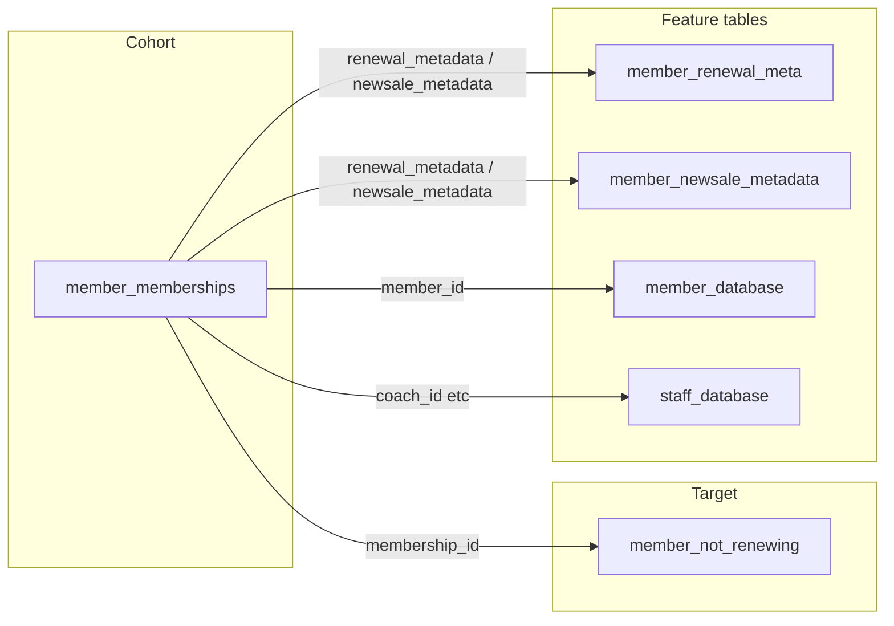

# Churn Logistic Model

## Goal

- **Model**: Binary logistic regression (scikit-learn) to predict churn.
- **Target**: Membership churned = 1 when `journey_stage = 'not_renewing'`, else 0 (aligned with [churn_analysis](https://github.com/towshau/churn_analysis/tree/main) and `member_not_renewing`).
- **Cohort**: Memberships that have already ended and have a clear renewal outcome: `end_date IS NOT NULL AND end_date < CURRENT_DATE AND journey_stage IN ('not_renewing', 'renewal_complete')`. Current counts: 254 churned (`not_renewing`), 698 not churned (`renewal_complete`). Other ended stages (e.g. `expired`, `no_sale`) are excluded so the cohort has a clean binary outcome.
- **Data**: One row per ended membership; features from `member_memberships`, `member_renewal_meta`, `member_newsale_metadata`, `member_database`, and optionally `staff_database`. Table name in DB is `member_newsale_metadata` (not `member_newsale_meta`).

## Data and joins

- **Cohort query**: From `member_memberships` where `end_date IS NOT NULL AND end_date < CURRENT_DATE AND journey_stage IN ('not_renewing', 'renewal_complete')`.
- **Label**: `churned = 1` when `journey_stage = 'not_renewing'`, else `0`. (Optional: assert consistency with `member_not_renewing.membership_id`.)
- **Joins**: Left-join `member_renewal_meta` on `mm.renewal_metadata = member_renewal_meta.id`, left-join `member_newsale_metadata` on `mm.newsale_metadata = member_newsale_metadata.id`, left-join `member_database` on `mm.member_id = member_database.id`, left-join `staff_database` on `mm.coach_id = staff_database.id` (and optionally other staff FKs).

## Feature set (minimal for v1)

- **From member_memberships**: tenure (e.g. `end_date - start_date` in days or months), `gym` (categorical), `membership_stage` / `status` (categorical), any numeric flags if useful.
- **From member_renewal_meta**: `session_credits`, `total_sessions`, `membership_weeks`, `price_paid`, `base_membership_value`, `per_session_value`, `hold_value`, `renewal_duration_points` (all numeric).
- **From member_newsale_metadata**: same type of fields where present (e.g. `session_credits`, `total_sessions`, `price_paid`, `membership_weeks`).
- **From member_database**: e.g. `initial_weight`, `initial_bf_percentage`, `height` (numeric); optionally `gender`, `referral_source_name` (categorical, encoded).
- **From staff_database**: optional (e.g. coach tenure or role); can be skipped in v1 to keep the model simple.

Handle missing metadata by using renewal_meta when present, else newsale_meta (or coalesce shared columns). Encode categoricals (e.g. `OneHotEncoder` or `pd.get_dummies`) and drop or impute nulls for the first version.

## Repo layout

- **Script**: Single Python script (e.g. `train_churn_model.py` at repo root or under a `churn_model/` folder) that:

  1. Loads env: `SUPABASE_URL`, `SUPABASE_SERVICE_ROLE_KEY` (or `SUPABASE_ANON_KEY` if RLS allows reading these tables).
  2. Fetches the cohort + labels + feature tables (one combined query or several, then merge in pandas).
  3. Builds feature matrix `X` and target `y` (churned 0/1).
  4. Splits with `train_test_split` (e.g. 80/20, stratified).
  5. Fits `LogisticRegression(solver='lbfgs', max_iter=1000, class_weight='balanced')` and optionally standardizes with `StandardScaler` (fit on train only).
  6. Evaluates on test: accuracy, precision, recall, F1, ROC-AUC; prints to stdout and/or writes a small report (e.g. `metrics.json` or `metrics.txt`).
  7. Optionally saves the model (e.g. `joblib.dump(model, 'churn_model.joblib')`) and the scaler so the workflow can upload them as artifacts.

- **Dependencies**: `requirements.txt` with `scikit-learn`, `pandas`, `supabase` (and `python-dotenv` if you use a `.env` locally). Pin versions for reproducibility.
- **GitHub Actions**: One workflow file (e.g. `.github/workflows/train-churn-model.yml`) that:
  - Triggers: e.g. `push` to `main` and/or `schedule` (cron, e.g. weekly).
  - Jobs: set up Python (e.g. 3.10 or 3.11), install from `requirements.txt`, run `python train_churn_model.py`.
  - Pass Supabase credentials via secrets: `SUPABASE_URL`, `SUPABASE_SERVICE_ROLE_KEY` (or whatever name you use in the script). Do not commit keys.
  - Optional: upload `churn_model.joblib` and `metrics.json` as workflow artifacts so you can download them from the Actions run.

## Implementation steps

1. **Add `requirements.txt`** (or extend existing) with `scikit-learn`, `pandas`, `supabase`, and optionally `python-dotenv`.
2. **Implement `train_churn_model.py`**:

   - Use `os.environ['SUPABASE_URL']` and `os.environ['SUPABASE_SERVICE_ROLE_KEY']` (or `SUPABASE_ANON_KEY`).
   - Build one SQL query (or a few) that returns one row per ended membership with: `membership_id`, `churned` (0/1), and all chosen feature columns from the six tables (with JOINs and COALESCE where needed). Alternatively fetch tables separately and merge in pandas.
   - Convert to DataFrame, encode categoricals, impute/drop nulls, then `X`/`y`.
   - Train/test split (stratified), scale, fit `LogisticRegression(class_weight='balanced')`, evaluate, print metrics, and optionally save model + scaler + metrics.

3. **Add `.github/workflows/train-churn-model.yml`**:

   - `actions/checkout`, `actions/setup-python` with cache for pip.
   - Install deps, run the script, and optionally `actions/upload-artifact` for the model and metrics.
   - Set `SUPABASE_URL` and `SUPABASE_SERVICE_ROLE_KEY` from GitHub Secrets (`secrets.SUPABASE_URL`, `secrets.SUPABASE_SERVICE_ROLE_KEY`).

4. **Document in README** (or a short `CHURN_MODEL.md`): what the script does, required env vars, how to run locally, and how to add the two GitHub secrets so the Action can run.

## GitHub secrets

In the repo: **Settings → Secrets and variables → Actions** add:

- `SUPABASE_URL`: project URL (e.g. `https://xxx.supabase.co`).
- `SUPABASE_SERVICE_ROLE_KEY`: service role key (so the workflow can read all six tables without RLS blocking). If you prefer anon key, use that and name the secret accordingly; ensure RLS allows read on these tables for that key.

## Clarifications already resolved

- **Table name**: Using `member_newsale_metadata` (actual table); you referred to it as member_newsale_meta.
- **Cohort**: Ended memberships with `journey_stage IN ('not_renewing', 'renewal_complete')`; label from `journey_stage = 'not_renewing'`.
- **Scope**: Single script, one workflow, minimal features to get a runnable model and CI in place. No UI or API in this plan.

## Optional follow-ups (out of scope for "most basic")

- Feature selection (e.g. recursive feature elimination or correlation filter).
- Cross-validation or multiple splits.
- Persisting feature list and schema for reproducibility.
- Scheduling the workflow at a specific time (cron) once you confirm you want it.
